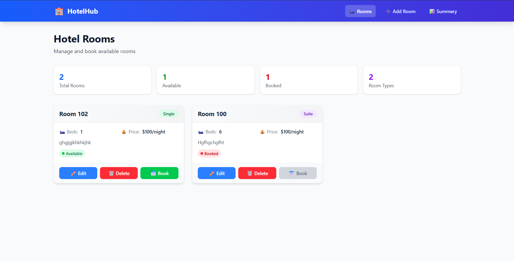

# Hotel Room Booking System 🏨

A full-stack hotel room booking system built with React + TypeScript + Tailwind CSS for the frontend and Express + TypeScript + Mongoose for the backend.

## Features

- **Room Management**: Create, Read, Update, Delete rooms
- **Room Booking**: Book available rooms with guest details
- **Booking Summary**: Aggregated view of all bookings with revenue tracking
- **Responsive Design**: Works on mobile, tablet, and desktop
- **Toast Notifications**: User-friendly feedback for all actions

## Tech Stack

### Frontend
- React 19 + TypeScript
- Vite
- Tailwind CSS
- RTK Query (Redux Toolkit)
- React Router DOM
- React Hot Toast

### Backend
- Express.js + TypeScript
- MongoDB with Mongoose
- CORS enabled

## Project Structure

```
Job_Task_Assignment/
├── backend/                # Express API
│   ├── src/
│   │   ├── config/        # Database config
│   │   ├── controllers/   # Request handlers
│   │   ├── middleware/    # Error handling
│   │   ├── models/        # Mongoose schemas
│   │   ├── routes/        # API routes
│   │   ├── types/         # TypeScript types
│   │   └── index.ts       # Entry point
│   └── package.json
│
├── frontend/               # React App
│   ├── src/
│   │   ├── components/    # UI components
│   │   ├── pages/         # Route pages
│   │   ├── store/         # Redux + RTK Query
│   │   ├── types/         # TypeScript types
│   │   └── App.tsx
│   └── package.json
│
└── README.md
```

## Getting Started

### Prerequisites
- Node.js 18+
- MongoDB Atlas account (or local MongoDB)

### 1. Backend Setup

```bash
cd backend
npm install
npm run dev
```

The backend will run on `http://localhost:5000`

### 2. Frontend Setup

```bash
cd frontend
npm install
npm run dev
```

The frontend will run on `http://localhost:5173`

## API Endpoints

| Method | Endpoint | Description |
|--------|----------|-------------|
| GET | `/api/rooms` | List all rooms (with pagination) |
| GET | `/api/rooms/:id` | Get single room |
| POST | `/api/rooms` | Create room |
| PUT | `/api/rooms/:id` | Update room |
| DELETE | `/api/rooms/:id` | Delete room |
| POST | `/api/bookings` | Create booking |
| GET | `/api/bookings/summary` | Get aggregated summary |

## Routes

- `/rooms` - View and manage all rooms
- `/create-room` - Add a new room
- `/booking-summary` - View booking statistics

## Screenshots

(./Screenshots/rooms.png)(./Screenshots/summary.png)(./Screenshots/room_booking.png)
